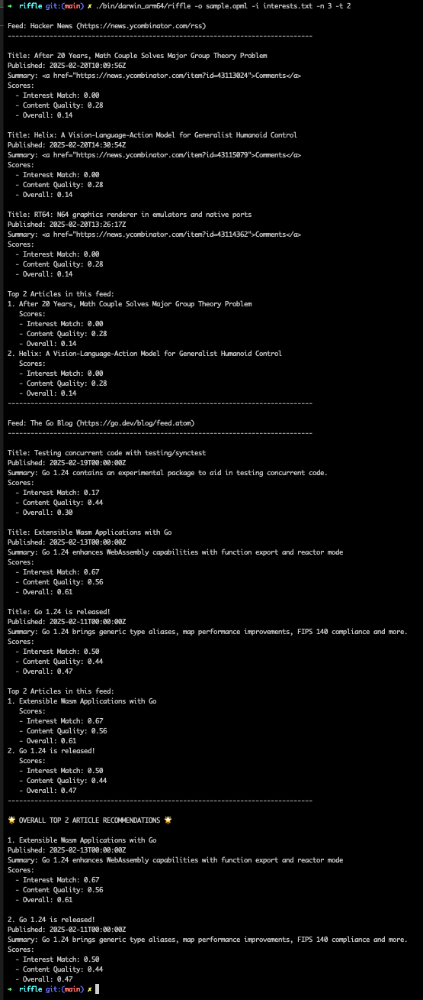

# Riffle

Riffle is an RSS feed analyzer and content recommender that helps you find the most valuable content from your RSS subscriptions. It analyzes articles based on content quality and your personal interests to provide intelligent recommendations.

## Screenshot



Example output showing article recommendations with interest matching and content quality scores.

## Features

- OPML feed list support
- Content quality analysis
- Personal interest matching
- Configurable article fetching
- Multiple recommendation levels
- Detailed scoring system
- Direct article URLs in output
- 2-day time window filtering

## Installation

To build the application:

```bash
make
```

This will create the binary in `bin/<os>_<arch>/riffle`.

## Quick Start

1. Copy the example configuration files:
   ```bash
   cp conf/feeds.opml my-feeds.opml
   cp conf/interests.txt my-interests.txt
   ```

2. Edit the files to match your interests:
   - Add your RSS feeds to `my-feeds.opml`
   - Add your interests to `my-interests.txt`

3. Run Riffle:
   ```bash
   riffle -o my-feeds.opml -i my-interests.txt
   ```

## Usage

Basic usage:

```bash
riffle -o <opml-file> [-i <interests-file>] [-n <article-count>] [-t <top-count>]
```

### Command Line Options

| Flag | Short | Description | Default |
|------|-------|-------------|---------|
| `--opml` | `-o` | Path to OPML file (required) | - |
| `--interests` | `-i` | Path to file containing interests (one per line) | - |
| `--articles` | `-n` | Number of articles to fetch from each feed (from last 2 days) | 3 |
| `--top` | `-t` | Number of top articles to recommend | 1 |

### Examples

1. Basic usage with default settings (3 articles from last 2 days, top 1 recommendation):
   ```bash
   riffle -o feeds.opml
   ```

2. Include personal interests for better recommendations:
   ```bash
   riffle -o feeds.opml -i interests.txt
   ```

3. Fetch more articles and get more recommendations:
   ```bash
   riffle -o feeds.opml -i interests.txt -n 5 -t 3
   ```

Note: Riffle only processes articles published within the last 2 days in your current time zone. Articles older than 2 days are automatically filtered out, even if you request more articles with the `-n` flag.

### Configuration Files

#### OPML File Format (feeds.opml)
The OPML file contains your RSS feed subscriptions, organized by category. Example structure:
```xml
<?xml version="1.0" encoding="UTF-8"?>
<opml version="1.0">
    <head>
        <title>Tech Feed Subscriptions</title>
    </head>
    <body>
        <outline text="Programming">
            <outline type="rss" 
                    text="The Go Blog" 
                    xmlUrl="https://go.dev/blog/feed.atom"/>
        </outline>
    </body>
</opml>
```

See `conf/feeds.opml` for a complete example with multiple feeds and categories.

#### Interests File Format (interests.txt)
The interests file contains your topics of interest, one per line. You can:
- Group interests with comments (lines starting with #)
- Use multiple words per interest
- Order by priority (all interests are weighted equally)

Example structure:
```
# Programming Languages
golang programming
rust development

# Technologies
cloud native
distributed systems
```

See `conf/interests.txt` for a complete example with various technology interests.

### Scoring System

Articles are scored based on multiple factors with equal weighting:

1. Content Quality (50%):
   - Text length (40% of quality score)
   - Keyword relevance (40% of quality score)
   - Link quality (20% of quality score)

2. Interest Match (50%):
   - Relevance to your specified interests
   - Matches are calculated using word-based analysis
   - Multiple word interests are handled intelligently

The final score is a combination of both factors, helping you find articles that are both high-quality and relevant to your interests.

## Development

### Prerequisites

- Go 1.24 or later
- Make

### Building for Different Platforms

To build for a specific platform:

```bash
make PLATFORMS=linux/amd64
```

Available platforms:
- linux/amd64
- linux/arm64
- darwin/amd64
- darwin/arm64

## License

This project is licensed under the Apache License 2.0 - see the [LICENSE](LICENSE) file for details. 